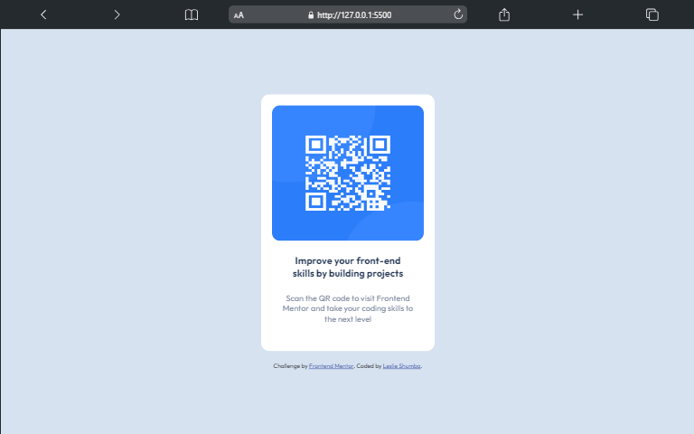

# Frontend Mentor - QR code component solution

This is a solution to the [QR code component challenge on Frontend Mentor](https://www.frontendmentor.io/challenges/qr-code-component-iux_sIO_H). Frontend Mentor challenges help you improve your coding skills by building realistic projects.

## Table of contents

- [Overview](#overview)
  - [Screenshot](#screenshot)
  - [Links](#links)
  - [Built with](#built-with)
  - [What I learned](#what-i-learned)
- [Author](#author)
- [Resources](#resources)

## Overview

Basic QR Code that to Frontend Mentor's page

### Screenshot

### Links

- Solution URL: [Github Link](https://github.com/layan2k/qr-code-component-main)
- Live Site URL:  [Live site](https://your-live-site-url.com)

### Built with

- Semantic HTML5 markup
- CSS custom properties
- Flexbox

### What I learned

I learned about positioning using flexbox.

- Flexbox can be used to position elements along the main axis (the direction set by `flex-direction`) or the cross axis (the direction perpendicular to the main axis).
- The main axis is typically the horizontal axis, but it can be the vertical axis if `flex-direction` is set to `column`.
- The cross axis is typically the vertical axis, but it can be the horizontal axis if `flex-direction` is set to `column`.
- The following properties can be used to control positioning in flexbox:
  - `justify-content`: Controls the alignment of items along the main axis.
  - `align-items`: Controls the alignment of items along the cross axis.
  - `align-content`: Controls the alignment of the flex items' main axes.

## Author

- Website - [LeslieTheDev](https://www.lesliethedev.me/)
- Frontend Mentor - [@layan2k](https://www.frontendmentor.io/profile/layan2k)
- Twitter - [@layan_2k](https://www.twitter.com/layan_2k)

## Resources

- [How CSS Positioning and Flexbox Work – Explained with Examples](https://www.freecodecamp.org/news/css-positioning-and-flexbox-explained/)
- [Box alignment in flexbox - CSS: Cascading Style Sheets | MDN](https://developer.mozilla.org/en-US/docs/Web/CSS/CSS_box_alignment/Box_alignment_in_flexbox)
